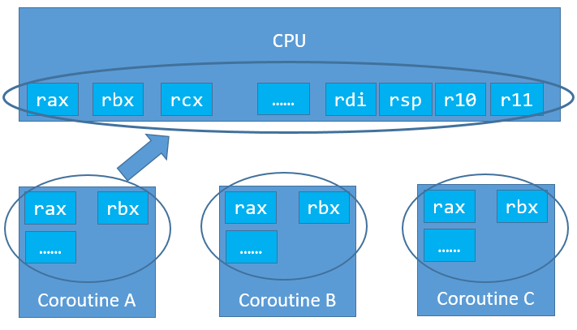

# 5.协程实现之切换

&emsp;&emsp;**问题：协程的上下文如何切换？切换代码如何实现？**
&emsp;&emsp;首先来回顾一下x86_64寄存器的相关知识。x86_64 的寄存器有16个64位寄存器，分别是：%rax, %rbx, %rcx, %esi, %edi, %rbp, %rsp, %r8, %r9, %r10, %r11, %r12,
&emsp;&emsp;%r13, %r14, %r15。
&emsp;&emsp;%rax 作为函数返回值使用的。
&emsp;&emsp;%rsp 栈指针寄存器，指向栈顶
&emsp;&emsp;%rdi, %rsi, %rdx, %rcx, %r8, %r9 用作函数参数，依次对应第1参数，第2参数。。。
&emsp;&emsp;%rbx, %rbp, %r12, %r13, %r14, %r15 用作数据存储，遵循调用者使用规则，换句话说，就是随便用。调用子函数之前要备份它，以防它被修改
&emsp;&emsp;%r10, %r11 用作数据存储，就是使用前要先保存原值。

&emsp;&emsp;上下文切换，就是将CPU的寄存器暂时保存，再将即将运行的协程的上下文寄存器，分别mov到相对应的寄存器上。此时上下文完成切换。如下图所示：  
  
&emsp;&emsp;切换_switch函数定义：  
&emsp;&emsp;int _switch(nty_cpu_ctx *new_ctx, nty_cpu_ctx *cur_ctx);
&emsp;&emsp;参数1：即将运行协程的上下文，寄存器列表
&emsp;&emsp;参数2：正在运行协程的上下文，寄存器列表
&emsp;&emsp;我们nty_cpu_ctx结构体的定义，为了兼容x86，结构体项命令采用的是x86的寄存器名字命名。
```
typedef struct _nty_cpu_ctx {
    void *esp; //
    void *ebp;
    void *eip;
    void *edi;
    void *esi;
    void *ebx;
    void *r1;
    void *r2;
    void *r3;
    void *r4;
    void *r5;
} nty_cpu_ctx;

```  

&emsp;&emsp; _switch返回后，执行即将运行协程的上下文。是实现上下文的切换  

```
0: __asm__ (
1: "    .text                                  \n"
2: "       .p2align 4,,15                                   \n"
3: ".globl _switch                                          \n"
4: ".globl __switch                                         \n"
5: "_switch:                                                \n"
6: "__switch:                                               \n"
7: "       movq %rsp, 0(%rsi)      # save stack_pointer     \n"
8: "       movq %rbp, 8(%rsi)      # save frame_pointer     \n"
9: "       movq (%rsp), %rax       # save insn_pointer      \n"
10: "       movq %rax, 16(%rsi)                              \n"
11: "       movq %rbx, 24(%rsi)     # save rbx,r12-r15       \n"
12: "       movq %r12, 32(%rsi)                              \n"
13: "       movq %r13, 40(%rsi)                              \n"
14: "       movq %r14, 48(%rsi)                              \n"
15: "       movq %r15, 56(%rsi)                              \n"
16: "       movq 56(%rdi), %r15                              \n"
17: "       movq 48(%rdi), %r14                              \n"
18: "       movq 40(%rdi), %r13     # restore rbx,r12-r15    \n"
19: "       movq 32(%rdi), %r12                              \n"
20: "       movq 24(%rdi), %rbx                              \n"
21: "       movq 8(%rdi), %rbp      # restore frame_pointer  \n"
22: "       movq 0(%rdi), %rsp      # restore stack_pointer  \n"
23: "       movq 16(%rdi), %rax     # restore insn_pointer   \n"
24: "       movq %rax, (%rsp)                                \n"
25: "       ret                                              \n"
26: );

```
&emsp;&emsp;按照x86_64的寄存器定义，%rdi保存第一个参数的值，即new_ctx的值，%rsi保存第二个参数的值，即保存cur_ctx的值。X86_64每个寄存器是64bit，8byte。  
&emsp;&emsp;Movq %rsp, 0(%rsi) 保存在栈指针到cur_ctx实例的rsp项  
&emsp;&emsp;Movq %rbp, 8(%rsi)   
&emsp;&emsp;Movq (%rsp), %rax  #将栈顶地址里面的值存储到rax寄存器中。Ret后出栈，执行栈顶  
&emsp;&emsp;Movq %rbp, 8(%rsi) #后续的指令都是用来保存CPU的寄存器到new_ctx的每一项中  
&emsp;&emsp;Movq 8(%rdi), %rbp #将new_ctx的值  
&emsp;&emsp;Movq 16(%rdi), %rax #将指令指针rip的值存储到rax中
&emsp;&emsp;Movq %rax, (%rsp) # 将存储的rip值的rax寄存器赋值给栈指针的地址的值。  
&emsp;&emsp;Ret # 出栈，回到栈指针，执行rip指向的指令。  
&emsp;&emsp;上下文环境的切换完成。


