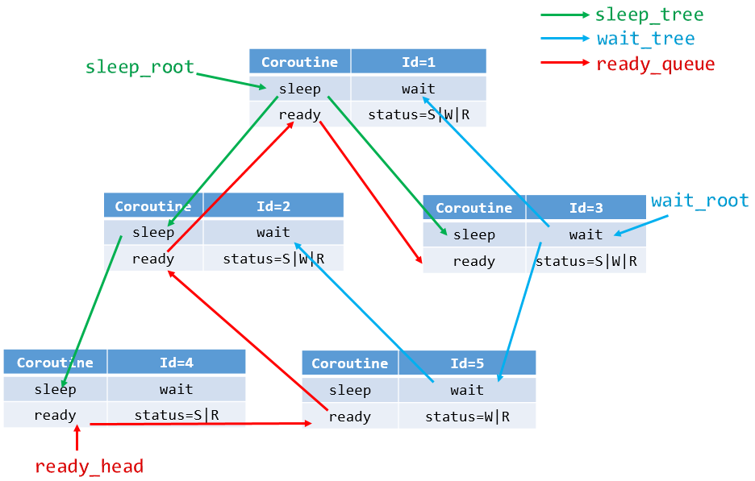
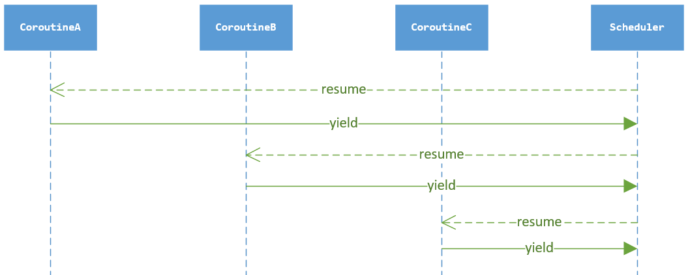

# 6.协程实现之定义

* [前言](#1)
* [6.1.运行体如何高效地在多种状态集合更换](#2)
* [6.2.调度器与协程的功能界限](#3)

<h3 id="1">前言</h3>
&emsp;&emsp;**问题：协程如何定义? 调度器如何定义？**  
&emsp;&emsp;先来一道设计题：  
&emsp;&emsp;设计一个协程的运行体R与运行体调度器S的结构体  
&emsp;&emsp;1. 运行体R：包含运行状态{就绪，睡眠，等待}，运行体回调函数，回调参数，栈指针，栈大小，当前运行体  
&emsp;&emsp;2. 调度器S：包含执行集合{就绪，睡眠，等待}  
&emsp;&emsp;这道设计题拆分两个个问题，一个运行体如何高效地在多种状态集合更换。调度器与运行体的功能界限。

<h3 id="2">6.1.运行体如何高效地在多种状态集合更换</h3>  
&emsp;&emsp;新创建的协程，创建完成后，加入到就绪集合，等待调度器的调度；协程在运行完成后，进行IO操作，此时IO并未准备好，进入等待状态集合；IO准备就绪，协程开始运行，后续进行sleep操作，此时进入到睡眠状态集合。  
&emsp;&emsp;就绪(ready)，睡眠(sleep)，等待(wait)集合该采用如何数据结构来存储？  
&emsp;&emsp;就绪(ready)集合并不没有设置优先级的选型，所有在协程优先级一致，所以可以使用队列来存储就绪的协程，简称为就绪队列（ready_queue）。  
&emsp;&emsp;睡眠(sleep)集合需要按照睡眠时长进行排序，采用红黑树来存储，简称睡眠树(sleep_tree)红黑树在工程实用为<key, value>, key为睡眠时长，value为对应的协程结点。  
&emsp;&emsp;等待(wait)集合，其功能是在等待IO准备就绪，等待IO也是有时长的，所以等待(wait)集合采用红黑树的来存储，简称等待树(wait_tree)，此处借鉴nginx的设计。

&emsp;&emsp;数据结构如下图所示：  
  
&emsp;&emsp;Coroutine就是协程的相应属性，status表示协程的运行状态。sleep与wait两颗红黑树，ready使用的队列，比如某协程调用sleep函数，加入睡眠树(sleep_tree)，status |= S即可。比如某协程在等待树(wait_tree)中，而IO准备就绪放入ready队列中，只需要移出等待树(wait_tree)，状态更改status &= ~W即可。有一个前提条件就是不管何种运行状态的协程，都在就绪队列中，只是同时包含有其他的运行状态。

<h3 id="3">6.2.调度器与协程的功能界限</h3>
&emsp;&emsp;**每一协程都需要使用的而且可能会不同属性的，就是协程属性。每一协程都需要的而且数据一致的，就是调度器的属性。**比如栈大小的数值，每个协程都一样的后不做更改可以作为调度器的属性，如果每个协程大小不一致，则可以作为协程的属性。  
&emsp;&emsp;**用来管理所有协程的属性，作为调度器的属性。比如epoll用来管理每一个协程对应的IO，是需要作为调度器属性。**  

&emsp;&emsp;按照前面几章的描述，定义一个协程结构体需要多少域，我们描述了每一个协程有自己的上下文环境，需要保存CPU的寄存器ctx；需要有子过程的回调函数func；需要有子过程回调函数的参数 arg；需要定义自己的栈空间 stack；需要有自己栈空间的大小 stack_size；需要定义协程的创建时间 birth；需要定义协程当前的运行状态 status；需要定当前运行状态的结点（ready_next, wait_node, sleep_node）；需要定义协程id；需要定义调度器的全局对象 sched。  
&emsp;&emsp;协程的核心结构体如下：
```
typedef struct _nty_coroutine {

    nty_cpu_ctx ctx;
    proc_coroutine func;
    void *arg;
    size_t stack_size;

    nty_coroutine_status status;
    nty_schedule *sched;

    uint64_t birth;
    uint64_t id;

    void *stack;

    RB_ENTRY(_nty_coroutine) sleep_node;
    RB_ENTRY(_nty_coroutine) wait_node;

    TAILQ_ENTRY(_nty_coroutine) ready_next;
    TAILQ_ENTRY(_nty_coroutine) defer_next;

} nty_coroutine;

```  

&emsp;&emsp;调度器是管理所有协程运行的组件，协程与调度器的运行关系。



&emsp;&emsp;调度器的属性，需要有保存CPU的寄存器上下文 ctx，可以从协程运行状态yield到调度器运行的。从协程到调度器用yield，从调度器到协程用resume。  
&emsp;&emsp;以下为协程的定义。
```
typedef struct _nty_coroutine_queue nty_coroutine_queue;

typedef struct _nty_coroutine_rbtree_sleep nty_coroutine_rbtree_sleep;
typedef struct _nty_coroutine_rbtree_wait nty_coroutine_rbtree_wait;

typedef struct _nty_schedule {
    uint64_t birth;
nty_cpu_ctx ctx;

    struct _nty_coroutine *curr_thread;
    int page_size;

    int poller_fd;
    int eventfd;
    struct epoll_event eventlist[NTY_CO_MAX_EVENTS];
    int nevents;

    int num_new_events;

    nty_coroutine_queue ready;
    nty_coroutine_rbtree_sleep sleeping;
    nty_coroutine_rbtree_wait waiting;

} nty_schedule;

```


