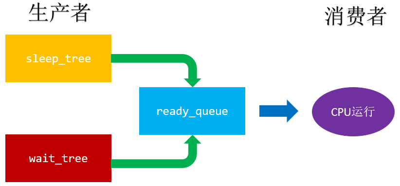
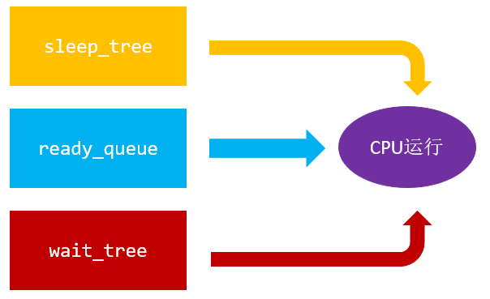

# 7.协程实现之调度器

* [前言](#1)
* [7.1.生产者消费者模式](#2)
* [7.2.多状态下运行](#3)


<h3 id="1">前言</h3>  

&emsp;&emsp;**问题：协程如何被调度？**

&emsp;&emsp;**调度器的实现，有两种方案，一种是生产者消费者模式，另一种多状态运行。**


<h3 id="2">7.1.生产者消费者模式</h3>



&emsp;&emsp;逻辑代码如下：

```
while (1) {

        //遍历睡眠集合，将满足条件的加入到ready
        nty_coroutine *expired = NULL;
        while ((expired = sleep_tree_expired(sched)) != ) {
            TAILQ_ADD(&sched->ready, expired);
        }

        //遍历等待集合，将满足添加的加入到ready
        nty_coroutine *wait = NULL;
        int nready = epoll_wait(sched->epfd, events, EVENT_MAX, 1);
        for (i = 0;i < nready;i ++) {
            wait = wait_tree_search(events[i].data.fd);
            TAILQ_ADD(&sched->ready, wait);
        }

        // 使用resume回复ready的协程运行权
        while (!TAILQ_EMPTY(&sched->ready)) {
            nty_coroutine *ready = TAILQ_POP(sched->ready);
            resume(ready);
        }
    }

```
<h3 id="3">7.2.多状态下运行</h3>



&emsp;&emsp;逻辑代码如下：

```
while (1) {

        //遍历睡眠集合，使用resume恢复expired的协程运行权
        nty_coroutine *expired = NULL;
        while ((expired = sleep_tree_expired(sched)) != ) {
            resume(expired);
        }

        //遍历等待集合，使用resume恢复wait的协程运行权
        nty_coroutine *wait = NULL;
        int nready = epoll_wait(sched->epfd, events, EVENT_MAX, 1);
        for (i = 0;i < nready;i ++) {
            wait = wait_tree_search(events[i].data.fd);
            resume(wait);
        }

        // 使用resume恢复ready的协程运行权
        while (!TAILQ_EMPTY(sched->ready)) {
            nty_coroutine *ready = TAILQ_POP(sched->ready);
            resume(ready);
        }
    }

```
