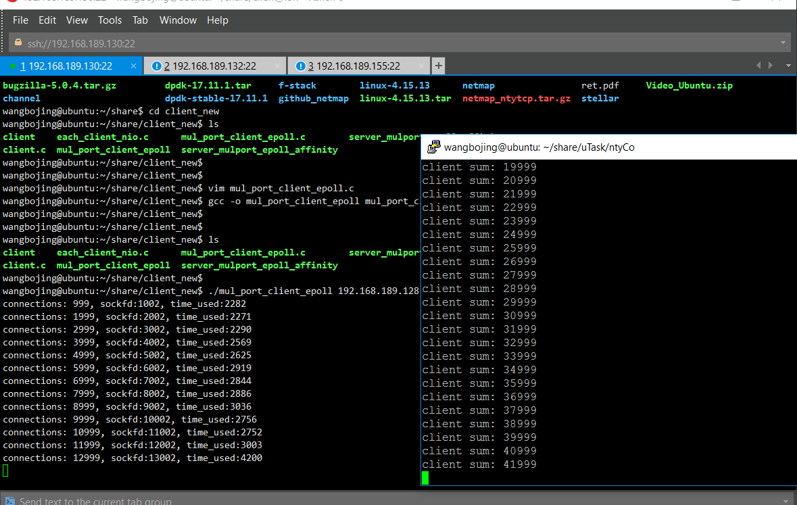
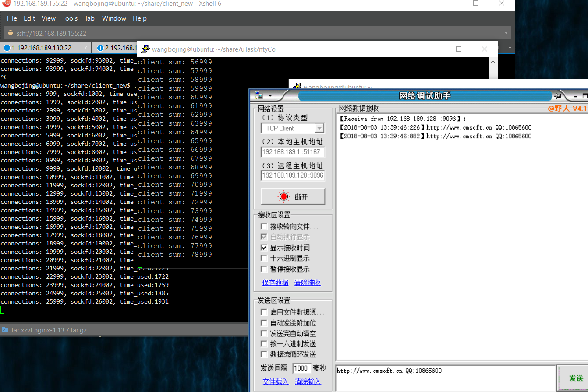

# 9.协程性能测试

测试环境：4台VMWare 虚拟机  
1台服务器 6G内存，4核CPU  
3台客户端 2G内存，2核CPU  
操作系统：ubuntu 14.04  
服务器端测试代码：[https://github.com/wangbojing/NtyCo](https://github.com/wangbojing/NtyCo) 
客户端测试代码：[https://github.com/wangbojing/c1000k_test/blob/master/client_mutlport_epoll.c](https://github.com/wangbojing/c1000k_test/blob/master/client_mutlport_epoll.c)

按照每一个连接启动一个协程来测试。每一个协程栈空间 4096byte  
6G内存 –> 测试协程数量100W无异常。并且能够正常收发数据。

